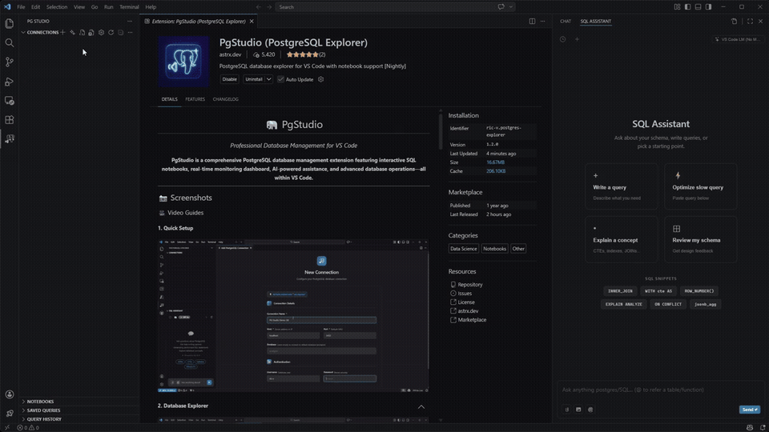

<div align="center">

# 🐘 PgStudio

### *Professional Database Management for VS Code*

[](https://marketplace.visualstudio.com/items?itemName=ric-v.postgres-explorer)
[](https://marketplace.visualstudio.com/items?itemName=ric-v.postgres-explorer)
[](https://marketplace.visualstudio.com/items?itemName=ric-v.postgres-explorer)
[](https://github.com/dev-asterix/PgStudio)

**PgStudio** (formerly YAPE) is a comprehensive PostgreSQL database management extension featuring interactive SQL notebooks, real-time monitoring dashboard, AI-powered assistance, and advanced database operations—all within VS Code.

[📖 **Documentation**](https://pgstudio.astrx.dev/) • [🛒 **Marketplace**](https://marketplace.visualstudio.com/items?itemName=ric-v.postgres-explorer) • [🤝 **Contributing**](#-contributing)

</div>

---

## 📺 Video Guides

### 1. Setup


### 2. Database Explorer


### 3. AI Assistant Setup


### 4. AI Assistant Usage


---

## ✨ Key Features

- 🔌 **Secure Connections** — VS Code SecretStorage encryption
- 🛡️ **Connection Safety** — Environment tagging (🔴 PROD, 🟡 STAGING, 🟢 DEV), read-only mode, query safety analyzer
- ⏱️ **Performance Tracking** — Historical query execution monitoring with degradation alerts
- 📊 **Live Dashboard** — Real-time metrics & query monitoring
- 📓 **SQL Notebooks** — Interactive notebooks with AI assistance
- 💾 **Saved Queries** — Tag-based organization, connection context restoration, AI metadata generation, edit & reuse
- 🌳 **Database Explorer** — Browse tables, views, functions, types, FDWs
- 🛠️ **Object Operations** — CRUD, scripts, VACUUM, ANALYZE, REINDEX
- 🏗️ **Visual Table Designer** — Create/Edit tables with a robust GUI
- 🔑 **Index & Constraint Manager** — Visual management of DB constraints
- 📋 **Smart Paste** — Context-aware clipboard actions (SQL/CSV/JSON)
- 📊 **Table Intelligence** — Profile, activity monitor, index usage, definition viewer
- 🔍 **EXPLAIN CodeLens** — One-click query analysis directly in notebooks
- 🛡️ **Auto-LIMIT** — Intelligent query protection (configurable, default 1000 rows)
- 🌍 **Foreign Data Wrappers** — Manage foreign servers, user mappings & tables
- 🤖 **AI-Powered** — Generate, Optimize, Explain & Analyze (OpenAI, Anthropic, Gemini)
- 📤 **Export Data** — Export results to CSV, JSON, or Excel

---

## 🎯 Why PgStudio?

<table>
<tr>
<td width="50%">

### 🎨 Modern Interface
- Beautiful, intuitive UI designed for developers
- Real-time dashboard with live metrics
- Context-aware operations
- Seamless VS Code integration

</td>
<td width="50%">

### ⚡ Powerful Features
- Interactive SQL notebooks
- 🤖 AI-powered Copilot & agentic support
- Table intelligence & performance insights
- Complete CRUD operations
- EXPLAIN CodeLens for query analysis

</td>
</tr>
<tr>
<td>

### 🛡️ Production-Ready Safety
- Environment tagging (Production/Staging/Dev)
- Read-only mode enforcement
- Query safety analyzer with risk scoring
- Auto-LIMIT for SELECT queries
- Status bar risk indicators

</td>
<td>

### 📊 Performance Insights
- Table profile with size & statistics
- Real-time activity monitoring
- Index usage analytics
- Bloat detection & warnings
- Query performance history & alerts
- Complete table definitions

</td>
</tr>
</table>

---

## 🚀 Quick Start

```bash
# Install from VS Code
ext install ric-v.postgres-explorer

# Or via command line
code --install-extension ric-v.postgres-explorer
```

Then: **PostgreSQL icon** → **Add Connection** → Enter details → **Connect!**


---

## 📚 Documentation Map

- `README.md` - Product overview, installation, development, and troubleshooting
- `docs/ARCHITECTURE.md` - System architecture and component/data-flow details
- `docs/STYLING_GUIDE.md` - Centralized styling/templates and UI refactoring patterns
- `docs/ROADMAP.md` - Active pipeline and upcoming phases
- `SECURITY.md` - Security policy and vulnerability reporting guidance
- `CHANGELOG.md` - Release notes and what changed across versions

**v0.8.8 (latest) —** Sidebar puts **Connections** and **SQL Assistant** first; **Saved Queries** and **Query History** start collapsed for fresh view state; **What’s New** is command-palette only. Notebook inline edits use **parameterized SQL inside transactions**. **Table Designer** adds **create-mode column reorder** and improved **SQL preview** styling. Details: `CHANGELOG.md`.

---

## 🏗️ Project Structure

```
PgStudio/
├── src/
│   ├── extension.ts          # Extension entry point
│   ├── commands/             # Command implementations
│   │   ├── tables.ts         # Table operations
│   │   ├── views.ts          # View operations
│   │   ├── functions.ts      # Function operations
│   │   ├── connection.ts     # Connection commands
│   │   ├── notebook.ts       # Notebook commands
│   │   ├── helper.ts         # Shared helper utilities
│   │   ├── sql/              # SQL template modules
│   │   │   ├── tables.ts     # Table SQL templates
│   │   │   ├── views.ts      # View SQL templates
│   │   │   ├── functions.ts  # Function SQL templates
│   │   │   ├── indexes.ts    # Index SQL templates
│   │   │   └── ...           # Other SQL templates
│   │   └── ...
│   ├── providers/            # VS Code providers
│   │   ├── DatabaseTreeProvider.ts   # Tree view provider
│   │   ├── NotebookKernel.ts         # Notebook kernel
│   │   ├── ChatViewProvider.ts       # AI chat provider
│   │   ├── SqlCompletionProvider.ts  # IntelliSense
│   │   └── ...
│   ├── services/             # Business logic
│   │   ├── ConnectionManager.ts      # Connection handling
│   │   └── SecretStorageService.ts   # Credential storage
│   ├── dashboard/            # Dashboard webview
│   ├── common/               # Shared utilities
│   └── test/                 # Unit tests
├── resources/                # Icons & screenshots
├── docs/                     # Documentation & landing page
├── dist/                     # Compiled output (bundled)
├── out/                      # Compiled output (tsc)
├── package.json              # Extension manifest
├── tsconfig.json             # TypeScript config
└── webpack.config.js         # Webpack config
```

---

## 💾 Saved Queries Library

Organize, manage, and reuse your most important queries with intelligent tagging and context preservation.

### Features
- **🏷️ Tag-Based Organization** — Group queries by topic (e.g., "analytics", "maintenance", "daily-reports")
- **🔗 Connection Context** — Queries remember their original connection, database, and schema
- **📓 Quick Reopening** — Click "Open in Notebook" to restore the query with full context in a new notebook
- **✏️ Edit Anytime** — Modify title, description, tags, and SQL without creating duplicates
- **🤖 AI Metadata** — Auto-generate titles, descriptions, and tags using AI
- **📊 Rich Metadata Display** — Hover to see creation date, last used, database, and schema

### Usage
1. **Save Query**: Click "Save Query" CodeLens button on any SQL cell in a notebook
2. **Add Metadata**: Enter title, description, and tags (AI can help auto-generate)
3. **Organize**: Use tags to group related queries
4. **Reuse**: Click a saved query → "Open in Notebook" to restore with original context
5. **Edit**: Right-click any saved query → "Edit Query" to modify it

---

## 🤖 AI-Powered Operations

PgStudio integrates advanced AI capabilities directly into your workflow, but keeps **YOU** in control.

### 🪄 Generate Query (Natural Language → SQL)
Describe what you need in plain English (e.g., "Show me top 10 users by order count"), and PgStudio will generate the SQL for you using your schema context.
- **Command Palette**: `AI: Generate Query`
- **Context-Aware**: The AI understands your table schemas, columns, and relationships.

### ⚡ Performance Optimization
Click the **Optimize** button on any successful query result.
- **Explain Scripts**: Generates `EXPLAIN ANALYZE` commands for deeper profiling.
- **Static Analysis**: Suggests missing indexes, query rewrites, or schema improvements.

### 📊 Data Analysis
Click the **Analyze Data** button in result tables.
- **Clean Workflow**: Automatically exports data to a temporary CSV and attaches it to the chat.
- **Actionable Insights**: AI summarizes patterns, trends, and outliers in your result sets.

### ✨ Error Handling (Explain & Fix)
When a query fails, get instant help directly in the error cell.
- **Explain Error**: Translates cryptic Postgres errors into plain English.
- **Fix Query**: Suggests corrected SQL to resolve the error.

### 🛡️ Safe Execution Model (Notebook-First)
We believe AI should assist, not take over. **No query is ever executed automatically.**
1. **Ask/Trigger**: You use one of the AI features.
2. **Review**: The AI generates SQL or suggestions in the chat.
3. **Insert**: You click "Open in Notebook" to place code into a cell.
4. **Execute**: You review the code and click "Run" when you are ready.

---

## 📊 Advanced Visualizations

Turn any query result into beautiful, interactive charts in seconds.

- **One-Click Charting**: Instantly visualize your data directly from the notebook results.
- **Customizable**: Toggle between Bar, Line, Pie, Doughnut, and Scatter charts.
- **Rich Data Display**:
    - **Log Scale**: Easily analyze data with wide variances.
    - **Blur/Glow Effects**: Modern, high-fidelity chart aesthetics.
    - **Zoom & Pan**: Inspect detailed data points interactively.

---

## 🛠️ Local Development

### Prerequisites

- **Node.js** ≥ 18.0.0
- **VS Code** ≥ 1.90.0
- **PostgreSQL** (for testing)

### Setup

```bash
# Clone the repository
git clone https://github.com/dev-asterix/PgStudio.git
cd PgStudio

# Install dependencies
npm install

# Compile TypeScript
npm run compile
```

### Development Commands

| Command | Description |
|---------|-------------|
| `npm run watch` | Watch mode (auto-recompile) |
| `npm run compile` | One-time TypeScript compilation |
| `npm run esbuild` | Bundle with esbuild (with sourcemaps) |
| `npm run esbuild-watch` | Bundle in watch mode |
| `npm run test` | Run unit tests |
| `npm run coverage` | Run tests with coverage |
| `npm run vscode:prepublish` | Build for production |

### Running the Extension

1. Open the project in VS Code
2. Press `F5` to launch Extension Development Host
3. Or use **Run and Debug** (`Ctrl+Shift+D`) → "Run Extension"

### Debugging Tips

- **Output Panel**: `Ctrl+Shift+U` → Select "PostgreSQL Explorer"
- **DevTools**: `Ctrl+Shift+I` in Extension Development Host
- **Webview Debug**: Right-click in webview → "Inspect"

---

## 🧪 Testing

### Quick Start

```bash
# Install dependencies
npm ci

# Run all tests
npm run test:all

# Run tests with coverage
npm run coverage

# Run specific test types
npm run test:unit           # Unit tests
npm run test:integration    # Integration tests with Docker
npm run test:renderer       # Renderer component tests
```

### Docker-Based Integration Tests

```bash
# Start PostgreSQL containers (12-17)
make docker-up

# Run integration tests
npm run test:integration

# Stop containers
make docker-down
```

### Using Make

```bash
make test-unit           # Unit tests
make test-integration    # Integration tests
make test-renderer       # Renderer component tests
make test-all            # All tests
make coverage            # Coverage report
make test-full           # Full suite with Docker
```

### Using Test Scripts

**Linux/macOS:**
```bash
./scripts/test.sh --unit
./scripts/test.sh --integration --pg 16
./scripts/test.sh --coverage
```

**Windows:**
```batch
scripts\test.bat --unit
scripts\test.bat --integration --pg 16
scripts\test.bat --coverage
```

### Testing Infrastructure

PgStudio includes comprehensive testing infrastructure:

- **Unit Tests** (50%+ coverage): Mocha + Chai + Sinon
- **Integration Tests**: Connection lifecycle, SSL, pool exhaustion, version compatibility
- **Component Tests**: Renderer with jsdom, tree views, forms, dashboards
- **Docker Containers**: PostgreSQL 12, 14, 15, 16, 17 for compatibility testing
- **CI/CD Pipeline**: GitHub Actions with Matrix testing (Node 18-22, PostgreSQL 12-17)

📖 **Testing docs**: Use the scripts listed above and CI workflow in `.github/workflows/test.yml`.

---

## 🤝 Contributing

- 🐛 [Report Bugs](https://github.com/dev-asterix/PgStudio/issues/new?template=bug_report.md)
- 💡 [Request Features](https://github.com/dev-asterix/PgStudio/issues/new?template=feature_request.md)
- 🔧 Fork → Branch → PR
- 🧪 Ensure all tests pass: `npm run test:all && npm run coverage`

### Commit Convention

We follow [Conventional Commits](https://www.conventionalcommits.org/):

```
feat: add new feature
fix: resolve bug
docs: update documentation
refactor: code restructuring
test: add/update tests
chore: maintenance tasks
```

---

## 📦 Building & Publishing

```bash
# Build VSIX package
npx vsce package

# Publish to VS Code Marketplace
npx vsce publish

# Publish to Open VSX
npx ovsx publish
```

---

## 📝 License

[MIT License](LICENSE)

---

<div align="center">

**Made with ❤️ for the PostgreSQL Community**

[](https://www.typescriptlang.org/)
[](https://www.postgresql.org/)
[](https://code.visualstudio.com/)

Also on [Open VSX](https://open-vsx.org/extension/ric-v/postgres-explorer)

</div>

---

## 🔧 Troubleshooting

### Connection Issues

#### SSL Connection Failures
**Problem**: `SSL connection failed` or `certificate verify failed`

**Solutions**:
- Disable SSL (development only): Set SSL Mode to `disable`
- Use `prefer` mode (tries SSL, falls back to non-SSL)
- Provide CA certificate: SSL Mode `verify-ca` + CA Certificate path

#### Connection Timeout
**Problem**: `Connection timeout` or `ETIMEDOUT`

**Solutions**:
- Increase connection timeout in settings
- Check firewall rules
- Verify PostgreSQL `pg_hba.conf` allows remote connections
- Ensure PostgreSQL is listening on correct interface

#### SSH Tunnel Issues
**Problem**: `SSH tunnel failed to establish`

**Solutions**:
- Verify SSH credentials and host
- Test SSH connection manually: `ssh user@host -p port`
- Check SSH key permissions: `chmod 600 ~/.ssh/id_rsa`
- Ensure SSH server allows port forwarding

### Performance Issues

#### Large Result Sets
**Problem**: Querying large tables causes freezes

**Solution**: Results are automatically limited to 10,000 rows. Use `LIMIT` clause for specific row counts.

#### Slow Tree View
**Problem**: Database tree takes long to load

**Solutions**:
- Use search filter to narrow objects
- Collapse unused schemas
- Disable object count badges in settings

### Common Error Messages

| Error | Cause | Solution |
|-------|-------|----------|
| `password authentication failed` | Wrong credentials | Verify username/password |
| `database does not exist` | Database name typo | Check database name |
| `permission denied` | Insufficient privileges | Grant SELECT permission |
| `too many connections` | Pool exhausted | Close unused connections |
| `no pg_hba.conf entry` | Access control | Add entry to `pg_hba.conf` |

---

## 🙈 Feature Comparison

| Feature | PgStudio | pgAdmin | DBeaver | TablePlus |
|---------|----------|---------|---------|-----------|
| **VS Code Integration** | ✅ Native | ❌ | ❌ | ❌ |
| **SQL Notebooks** | ✅ Interactive | ❌ | ❌ | ❌ |
| **AI Assistant** | ✅ Built-in | ❌ | ❌ | ❌ |
| **Real-time Dashboard** | ✅ | ✅ | ⚠️ Limited | ⚠️ Limited |
| **Inline Cell Editing** | ✅ | ✅ | ✅ | ✅ |
| **Export Formats** | CSV, JSON, Excel | CSV, JSON | CSV, JSON, Excel | CSV, JSON, SQL |
| **SSH Tunneling** | ✅ | ✅ | ✅ | ✅ |
| **Foreign Data Wrappers** | ✅ Full | ✅ | ⚠️ Limited | ❌ |
| **License** | MIT (Free) | PostgreSQL (Free) | Apache 2.0 (Free) | Proprietary (Paid) |

### Unique to PgStudio
- 🤖 AI-powered query generation and optimization
- 📓 Interactive SQL notebooks with persistent state
- 🔄 Infinite scrolling for large result sets (10k rows)
- 🎨 Modern UI integrated into VS Code
- 🚀 Hybrid connection pooling for performance

