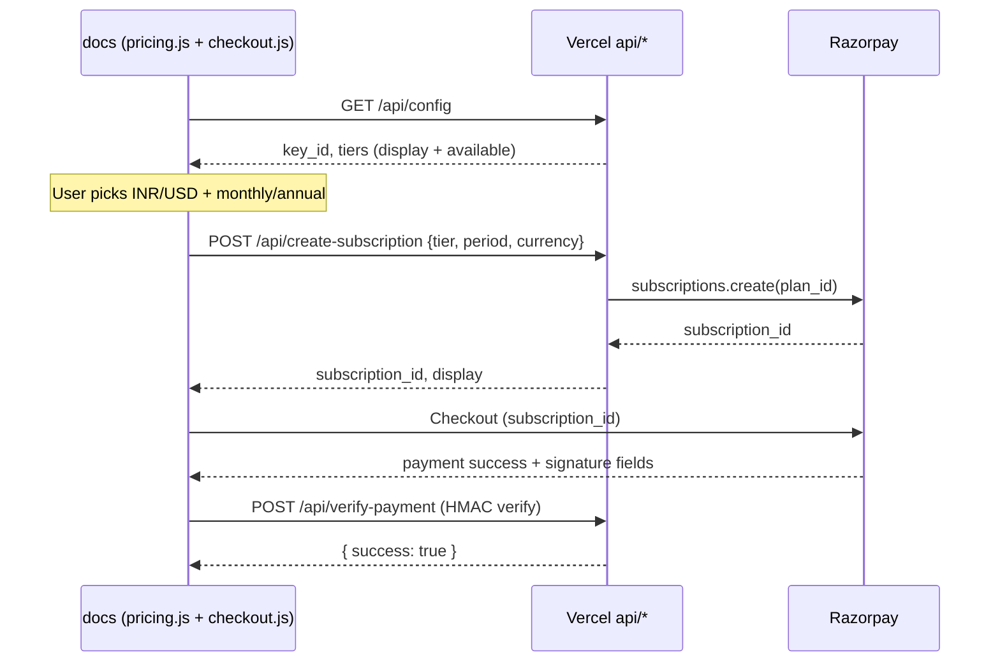

# Razorpay setup & pricing (docs site)

Last updated: 2026-06-02

The marketing site at `docs/` sells **Sponsor** and **Singularity** subscriptions via [Razorpay Subscriptions](https://razorpay.com/docs/payments/subscriptions/). Checkout is server-driven: Vercel serverless functions in `api/` create subscriptions; the browser opens Razorpay Checkout and verifies the payment signature.

**Related:** [WEBSITE_CONTEXT.md](./WEBSITE_CONTEXT.md) (landing IA, deploy overview) · [roadmap/license-implementation.md](./roadmap/license-implementation.md) (extension license activation — not wired to Razorpay yet)

---

## Pricing tiers

| Tier | Key | Who it's for | Billing |
|------|-----|--------------|---------|
| **Free** | — | Everyone | $0 — install from [VS Code Marketplace](https://marketplace.visualstudio.com/items?itemName=ric-v.postgres-explorer) |
| **Sponsor** | `sponsor` | Individual pro users | Razorpay subscription |
| **Singularity** | `singularity` | Teams / org (flat org license, not per seat) | Razorpay subscription |

Feature copy on the landing page lives in `docs/html/minimized-overview.html` (pricing section). Paid tiers include everything below the previous tier plus the bullets listed there.

---

## Canonical prices

Amounts shown on cards come from `api/plan-config.js` defaults unless overridden with `RAZORPAY_DISPLAY_*` env vars. **Razorpay Plan billing amounts in the dashboard must match these** (minor units: paise for INR, cents for USD).

| Tier | Period | INR | USD | ~Annual savings vs 12× monthly |
|------|--------|-----|-----|--------------------------------|
| Sponsor | Monthly | ₹199/mo | $2/mo | — |
| Sponsor | Annual | ₹1,990/yr | $20/yr | ~17% |
| Singularity | Monthly | ₹899/mo | $9/mo | — |
| Singularity | Annual | ₹8,990/yr | $90/yr | ~17% |

**Razorpay dashboard amounts (create Plans with these charge amounts):**

| Env key suffix | Billing interval | INR (₹) | USD ($) |
|----------------|------------------|---------|---------|
| `SPONSOR_MONTHLY_INR` | Every 1 month | 199 | — |
| `SPONSOR_ANNUAL_INR` | Every 1 year | 1,990 | — |
| `SPONSOR_MONTHLY_USD` | Every 1 month | — | 2.00 |
| `SPONSOR_ANNUAL_USD` | Every 1 year | — | 20.00 |
| `SINGULARITY_MONTHLY_INR` | Every 1 month | 899 | — |
| `SINGULARITY_ANNUAL_INR` | Every 1 year | 8,990 | — |
| `SINGULARITY_MONTHLY_USD` | Every 1 month | — | 9.00 |
| `SINGULARITY_ANNUAL_USD` | Every 1 year | — | 90.00 |

The UI toggle “Save ~17%” on annual billing matches `(12 × monthly − annual) / (12 × monthly)` for both tiers and currencies.

---

## Architecture



| Piece | Location | Role |
|-------|----------|------|
| Price labels & toggles | `docs/js/pricing.js` | INR/USD + monthly/annual; loads catalog from `/api/config` |
| Checkout | `docs/js/checkout.js` | Creates subscription, opens Razorpay, verifies signature |
| Plan resolution | `api/plan-config.js` | Env → plan IDs, display strings, `available` flag |
| Public config | `api/config.js` | `GET` — `key_id` + tier catalog (no secret) |
| Create subscription | `api/create-subscription.js` | `POST` — `{ tier, period, currency }` |
| Verify payment | `api/verify-payment.js` | `POST` — HMAC-SHA256 over `order_id\|payment_id` |
| Local dev server | `scripts/dev-server.js` | Serves `docs/` + mounts same API routes |
| Env template | `.env.example` | All `RAZORPAY_*` keys |

Checkout buttons: `data-tier="sponsor"` / `data-tier="singularity"` on cards with `data-pricing-tier` for live price updates. Pay buttons stay **disabled** until the matching `RAZORPAY_PLAN_*` env var is set to a real `plan_…` id (`available: false` in catalog).

---

## Environment variables

Copy from repo root:

```bash
cp .env.example .env
```

| Variable | Required | Description |
|----------|----------|-------------|
| `RAZORPAY_KEY_ID` | Yes | Dashboard → API Keys → Key ID (`rzp_test_…` or `rzp_live_…`) |
| `RAZORPAY_KEY_SECRET` | Yes | Secret for server-side API + signature verification (never expose to browser) |
| `RAZORPAY_PLAN_{TIER}_{PERIOD}_{CURRENCY}` | Per plan | Eight plan IDs — see table below |
| `RAZORPAY_DISPLAY_{TIER}_{PERIOD}_{CURRENCY}` | No | Override card label (e.g. `₹199/mo`); defaults in `plan-config.js` |

**Tier / period / currency** in env names are uppercase: `SPONSOR`, `SINGULARITY` × `MONTHLY`, `ANNUAL` × `INR`, `USD`.

```
RAZORPAY_PLAN_SPONSOR_MONTHLY_INR
RAZORPAY_PLAN_SPONSOR_ANNUAL_INR
RAZORPAY_PLAN_SPONSOR_MONTHLY_USD
RAZORPAY_PLAN_SPONSOR_ANNUAL_USD
RAZORPAY_PLAN_SINGULARITY_MONTHLY_INR
RAZORPAY_PLAN_SINGULARITY_ANNUAL_INR
RAZORPAY_PLAN_SINGULARITY_MONTHLY_USD
RAZORPAY_PLAN_SINGULARITY_ANNUAL_USD
```

**Migration:** Older deployments used `RAZORPAY_PLAN_STUDIO_*` / `RAZORPAY_PLAN_TEAM_*`. Those keys are ignored; recreate eight Plans under Sponsor/Singularity naming and update Vercel env.

Never commit `.env`. Set the same variables in **Vercel → Project → Settings → Environment Variables** for Production (and Preview if you test PRs).

---

## Razorpay Dashboard setup

Do this in **Test Mode** first, then duplicate Plans in Live Mode with live API keys.

### 1. API keys

1. [Razorpay Dashboard](https://dashboard.razorpay.com/) → **Settings → API Keys**.
2. Generate **Test** keys → put `key_id` / `key_secret` in `.env` and Vercel.
3. After end-to-end test, repeat for **Live** keys and live Plans.

### 2. Enable subscriptions

1. **Subscriptions** must be enabled on the account (Razorpay may require activation — follow their onboarding).
2. For **USD** Plans, enable **international payments** (Settings → Payment methods / international, per Razorpay’s current UI).

### 3. Create eight Plans

**Subscriptions → Plans → Create Plan** (repeat eight times).

Use a consistent naming scheme, e.g. `PgStudio Sponsor Monthly INR`.

| Plan purpose | Interval | Currency | Amount |
|--------------|----------|----------|--------|
| Sponsor monthly | Monthly | INR | ₹199 |
| Sponsor annual | Yearly | INR | ₹1,990 |
| Sponsor monthly | Monthly | USD | $2 |
| Sponsor annual | Yearly | USD | $20 |
| Singularity monthly | Monthly | INR | ₹899 |
| Singularity annual | Yearly | INR | ₹8,990 |
| Singularity monthly | Monthly | USD | $9 |
| Singularity annual | Yearly | USD | $90 |

Copy each Plan’s id (`plan_xxxxxxxxxxxx`) into the matching `RAZORPAY_PLAN_*` env var.

Optional: set **Plan notes** or description to `tier=sponsor period=monthly currency=INR` for support debugging (checkout also sends `notes` on the subscription create call).

### 4. Webhooks (recommended — not implemented in repo yet)

For production you should add a webhook endpoint for `subscription.activated`, `subscription.charged`, `subscription.cancelled`, and payment failures, then issue extension licenses from those events. Today, success UI only runs after **client-side** signature verification in `verify-payment.js`; there is no server-side entitlement store. See [license-implementation.md](./roadmap/license-implementation.md).

---

## Local development

```bash
# From repo root
cp .env.example .env
# Fill RAZORPAY_KEY_ID, RAZORPAY_KEY_SECRET, and all eight RAZORPAY_PLAN_* values

cd api && npm install && cd ..
npm install   # express for dev-server (root package.json)

npm run dev:site
# → http://localhost:3000
```

1. Open the site, scroll to **Pricing**.
2. Toggle INR/USD and monthly/annual — prices should update from `/api/config`.
3. **Get Sponsor** / **Get Singularity** should open Razorpay Checkout when `available` is true.
4. Use Razorpay [test cards](https://razorpay.com/docs/payments/payments/test-card-details/) (INR; use international test flow for USD if enabled).

If pay buttons stay disabled, check browser console for catalog errors and confirm plan env vars are not empty or `plan_` placeholder.

---

## Vercel deployment

`vercel.json`:

- `outputDirectory`: `docs` (static site)
- `api/*.js`: serverless functions (`config`, `create-subscription`, `verify-payment`)

Deploy steps:

1. Connect the Git repo to Vercel.
2. Set all `RAZORPAY_*` env vars for **Production** (test keys only on Preview if desired).
3. Deploy; confirm `GET https://<your-domain>/api/config` returns `key_id` and `tiers.*.*.available: true` for configured plans.

Custom domain: `docs/CNAME` if used with your DNS provider.

---

## API reference (docs checkout)

### `GET /api/config`

Response:

```json
{
  "key_id": "rzp_test_…",
  "supported_currencies": ["INR", "USD"],
  "tiers": {
    "sponsor": {
      "name": "Sponsor",
      "monthly": {
        "INR": { "display": "₹199/mo", "available": true },
        "USD": { "display": "$2/mo", "available": true }
      },
      "annual": { "…": "…" }
    },
    "singularity": { "…": "…" }
  }
}
```

### `POST /api/create-subscription`

Body: `{ "tier": "sponsor"|"singularity", "period": "monthly"|"annual", "currency": "INR"|"USD" }`

Success: `{ "subscription_id", "key_id", "tier", "period", "currency", "display" }`

Errors: `400` invalid tier/period/currency or missing plan config; `401` bad Razorpay credentials; `500` Razorpay API failure.

### `POST /api/verify-payment`

Body: `{ "razorpay_order_id", "razorpay_payment_id", "razorpay_signature" }` (from Checkout `handler`).

Success: `{ "success": true }`. Signature mismatch → `400` (do not treat as paid).

---

## Currency detection (UI)

`pricing.js` defaults:

- **INR** if timezone is `Asia/Kolkata`, or `navigator.language` is `en-in` / `hi-in`
- **USD** otherwise

User overrides are stored in `sessionStorage` (`pgstudio_pricing_currency`, `pgstudio_pricing_period`).

---

## Checklist before go-live

- [ ] Eight Plans created in **Live** mode with amounts matching the price table
- [ ] Live `RAZORPAY_KEY_ID` / `RAZORPAY_KEY_SECRET` on Vercel Production
- [ ] All eight `RAZORPAY_PLAN_*` set to live `plan_…` ids
- [ ] International payments enabled for USD Plans
- [ ] Test checkout on Production domain (small real charge or Razorpay live test procedure)
- [ ] Plan webhook + license delivery (follow-up — not in current codebase)

---

## Troubleshooting

| Symptom | Likely cause |
|---------|----------------|
| Pay button disabled, tooltip “plan not configured” | Missing or placeholder `RAZORPAY_PLAN_*` for current tier/period/currency |
| `Plan not configured for …` on checkout | Same — or typo in env name (must match `plan-config.js` keys exactly) |
| `Authentication failed with Razorpay API` | Wrong secret, test key with live plan (or vice versa) |
| Prices show `—` | `/api/config` failed — run via `dev:site` or Vercel, not raw `file://` |
| Checkout works locally but not on Vercel | Env vars not set for the deployment environment you’re hitting |
| Payment succeeds but extension still free | Expected until license service + webhooks are implemented |

---

## Files to touch when prices change

1. Amounts in **Razorpay Dashboard** (edit or create new Plans — changing amount often requires a new Plan id).
2. `api/plan-config.js` → `DEFAULT_DISPLAY` (and optional `.env.example` comments).
3. Redeploy Vercel; update `RAZORPAY_PLAN_*` if Plan ids changed.
4. Optional: `RAZORPAY_DISPLAY_*` overrides without code deploy.

Landing HTML (`minimized-overview.html`) shows static fallback amounts in markup; live values are overwritten by `pricing.js` after `/api/config` loads.
